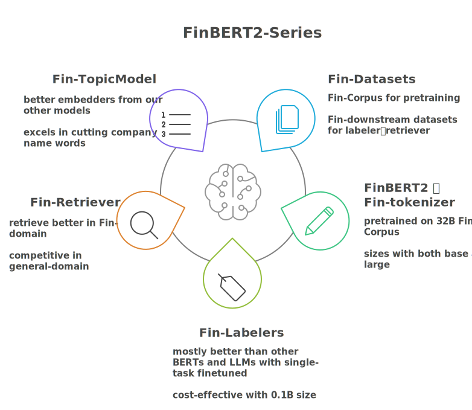
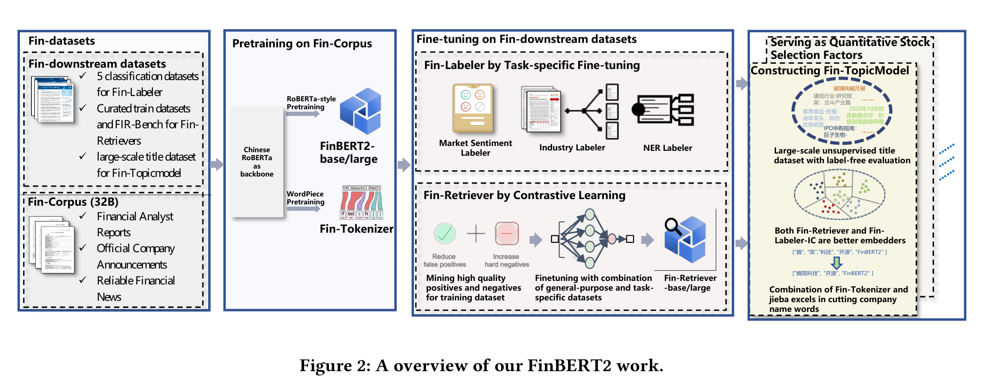

<h1 align="center">⚡️FinBERT2: 弥合金融领域LLMs部署差距的专业双向编码器 </h1>
<p align="center">
    <a href="https://huggingface.co/valuesimplex-ai-lab/">
        
    </a>
    <a href="https://github.com/
valuesimplex/FinBERT2">
            
    </a>
    <a href="https://github.com/
valuesimplex/FinBERT2/LICENSE">
        
    </a>

<h4 align="center">
    <p>
        <a href="#背景">背景</a> |
        <a href="#安装">安装</a> |
        <a href="#模型列表">模型列表</a> |
        <a href="#Reference">Reference</a> |
        <a href="#citation">Citation</a> |
        <a href="#license">License</a> 
    <p>
</h4>

[FinBERT2-中文](README.md)  |  [FinBERT2-English](README_en.md) |  [FinBERT1](https://github.com/valuesimplex/FinBERT/blob/main/FinBERT1_README.md)




🌟Paper🌟: https://dl.acm.org/doi/10.1145/3711896.3737219

🌟Datasets and Checkpoints🌟: https://huggingface.co/valuesimplex-ai-lab/


## 背景

本次开源的 FinBERT2 是熵简科技开源模型 [FinBERT](https://github.com/valuesimplex/FinBERT/blob/main/FinBERT1_README.md) （于2020年开源）的第二代升级模型。FinBERT2 在 320亿+ Token 的高质量中文金融语料进行深度预训练，旨在提升大语言模型（LLMs）在金融领域应用部署中的表现。

本次开源工作包含了预训练模型 FinBERT2、应用于特定下游任务的微调模型及相关数据集，以支持更多金融科技领域的创新研究与应用实践，并与社区伙伴共同推动金融AI生态的繁荣发展。

## FinBERT2简介



FinBERT2 可以通过以下方面弥合LLM在金融特定场景部署方面的差距：

1. **大规模中文金融语料预训练**：本次 FinBERT2 的金融语料预训练规模超过 320亿 Token，后续我们将对于这一模型开源。据我们所知，在开源的中文金融领域 BERT 类模型中，这将是预训练语料规模最大、性能表现最好的模型；

2. **优越的金融文本分类性能**：FinBERT2 在各类金融分类任务上，平均表现优于其他（Fin）BERT变体0.4%-3.3%，并领先主流大语言模型（如GPT-4-turbo, Claude 3.5 Sonnet, Qwen2）9.7%-12.3%；

3. **卓越的向量化信息检索（Fin-Retrievers）**：作为RAG系统的检索组件，FinBERT2 在性能上超越了开源和商业的向量化模型。在五个典型金融检索任务上，FinBERT2 相较于 BGE-base-zh平均性能提升了+6.8%，相较于OpenAI的text-embedding-3-large平均性能提升了+4.2%。

其他更详细的介绍及评测结果请参考我们的原始论文。
 
# 安装
### 1. clone项目源码
```
git clone https://github.com/valuesimplex/FinBERT.git
```
### 2. 创建虚拟环境
```bash
conda create --name FinBERT python=3.11
conda activate FinBERT
```

### 3. 安装依赖

运行以下命令安装 `requirements.txt` 中列出的所有依赖：
```bash
pip install -r requirements.txt
```

### 4. 运行项目
一旦安装完成，可以进入对应文件夹运行项目：
####  File Structure

```
FinBERT2
├── Fin-labeler                                    # * Fine-tuning models for classification tasks
│   ├── SC_2/                                      # * Sentiment classification dataset (2-class)
│   ├── runclassify.sh                             # * Shell script for running classification
│   └── sequence_inference.py                      # * Sequence inference script
├── Fin-retriever                                  # * Contrastive learning-based retrieval models
│   ├── contrastive_finetune.sh                    # * Shell script for contrastive fine-tuning
│   └── finetune_traindata_sample.json             # * Sample training data for retrieval fine-tuning
├── Fin-Topicmodel                                 # * Topic modeling for financial titles
│   ├── Fin-Topicmodel.ipynb                       # * Main notebook for topic modeling
├── FinBERT2/                                      # * Core FinBERT2 model implementation
│   ├── pretrain/                                  # * Pre-training scripts and modules
│   │   ├── run_mlm.sh                             # * MLM training script
│   └── pretrain_wordpiece_tokenizer/              # * WordPiece tokenizer training
│       ├── spm.sh                                 # * SentencePiece training script
```


## 快速开始
### 对 FinBERT2 预训练模型进行增量预训练
```
cd FinBERT2\pretrain
sh run_mlm.sh
```
### FinBERT2 用于金融文本分类

```
# 微调
cd FinBERT2\Fin-labeler
sh runclassify.sh

# 预测
python sequence_inference.py
```

### 对比学习微调

参考[FlagEmbedding](https://github.com/FlagOpen/FlagEmbedding/tree/master/examples/finetune/embedder
)项目

### 使用 Fin-Retriever-base 向量检索模型

```
from sentence_transformers import SentenceTransformer
import numpy as np

# 加载 Fin-Retrievers 模型
model = SentenceTransformer('valuesimplex-ai-lab/fin-retriever-base')

# 设置原始查询
query = "美联储加息对科技股的影响"

# 关键步骤：为查询添加提示语，保持与模型训练时一致
optimized_query = "为这个句子生成表示以用于检索相关文章：" + query

# 构建文档列表（含标题、机构、作者等结构化信息）
documents = [
    {
        "title": "美联储加息对科技股估值影响分析",
        "company": "",  
        "institution": "摩根士丹利",
        "industry": "科技综合",
        "author": "张伟",
        "type": "策略报告",
        "content": "2023年美联储连续加息导致科技股估值大幅回调，特别是高成长性科技公司。历史数据显示，利率每上升25个基点，科技板块平均下跌3.5%。FAANG股票受冲击最明显，其中Meta和Netflix估值压缩幅度最大。"
    },
    {
        "title": "美联储加息对全球资产配置的影响",
        "company": "",  
        "institution": "瑞银",
        "industry": "宏观经济",
        "author": "李强",
        "type": "宏观研究",
        "content": "本文系统分析美联储加息对全球股债汇市的影响，科技股作为权益资产的一部分，其波动在本文中被纳入整体市场分析框架。报告特别关注了新兴市场货币波动和商品价格变化，科技股仅占分析篇幅的15%。"
    },
    {
        "title": "中国科技股监管政策变化及投资机会",
        "company": "腾讯控股", 
        "institution": "中金公司",
        "industry": "互联网",
        "author": "陈明",
        "type": "行业研究",
        "content": "中国科技板块近期受监管政策放松驱动上涨，本文聚焦国内政策变化对互联网公司的影响，包括游戏版号发放、平台经济监管等。报告详细分析了腾讯、阿里巴巴和美团的监管风险变化，未讨论美联储货币政策影响。"
    },
    {
        "title": "加息周期中银行股的投资价值分析",
        "company": "招商银行", 
        "institution": "中信证券",
        "industry": "银行",
        "author": "赵静",
        "type": "行业深度",
        "content": "美联储加息显著改善银行净息差，本文测算国内上市银行净利息收入将提升8-12%。重点分析了招商银行、工商银行和中国银行的受益程度。科技股作为对比板块简要提及，指出其融资成本上升的压力。"
    },
    {
        "title": "生猪养殖行业周期反转信号分析",
        "company": "牧原股份",  
        "institution": "长江证券",
        "industry": "农林牧渔",
        "author": "刘洋",
        "type": "行业报告",
        "content": "能繁母猪存栏量连续三个月下降，预示猪周期即将反转。我们预计2024年生猪价格将上涨40%，牧原股份、温氏股份和新希望等龙头养殖企业盈利改善空间显著。报告未涉及科技股或货币政策。"
    },
    {
        "title": "光伏产业链价格走势及技术迭代分析",
        "company": "隆基绿能",  
        "institution": "国金证券",
        "industry": "电力设备",
        "author": "杨光",
        "type": "产业链研究",
        "content": "硅料价格降至100元/kg以下，刺激下游装机需求。TOPCon电池量产效率突破25.5%，隆基绿能、通威股份和晶科能源技术领先。报告分析光伏行业供需格局，与科技股和货币政策无直接关联。"
    },
    {
        "title": "美债收益率上升对科技股ETF的影响",
        "company": "", 
        "institution": "华泰证券",
        "industry": "金融产品",
        "author": "周涛",
        "type": "基金研究",
        "content": "分析10年期美债收益率上升对科技行业ETF(如XLK、QQQ)的影响机制。报告指出利率上升1%将导致科技ETF估值下降10-15%，但未讨论具体科技公司基本面变化。重点比较了不同ETF产品的久期和利率敏感性。"
    }
]

# 定义文档类型标签（用于展示正负例标签）
doc_types = {
    0: "正例",
    1: "难负例",
    2: "难负例",
    3: "难负例",
    4: "随机负例",
    5: "随机负例",
    6: "难负例"
}

# 将文档格式化为结构化文本，增强模型理解能力
formatted_docs = []
for doc in documents:
    text = (
        f"文章标题：{doc['title']}\n"
        f"公司名称：{doc['company']}\n"
        f"发布机构：{doc['institution']}\n"
        f"行业：{doc['industry']}\n"
        f"作者：{doc['author']}\n"
        f"{doc['type']}：{doc['content']}"
    )
    formatted_docs.append(text)

# 拼接查询和所有文档，作为整体输入
all_texts = [optimized_query] + formatted_docs

# 生成句向量（第一项为查询向量，后续为文档向量）
embeddings = model.encode(all_texts)

# 拆分查询向量和文档向量
query_vector = embeddings[0]
doc_vectors = embeddings[1:]

# 计算点积相似度（可替代余弦相似度）
scores = query_vector @ doc_vectors.T

# 输出查询内容
print("【查询】:", query)
print("【文档匹配分数】:")

# 对所有文档按分数排序（高到低）
sorted_indices = np.argsort(scores)[::-1]

# 依次输出文档分数、标签和关键信息
for idx in sorted_indices:
    doc = documents[idx]
    print(f"分数: {scores[idx]:.4f} | 类型: {doc_types[idx]} | 标题: {doc['title']} | 机构: {doc['institution']},内容: {doc['content'][:60]}...")

#【查询】: 美联储加息对科技股的影响
# 【文档匹配分数】:
# 分数: 0.9015 | 类型: 正例 | 标题: 美联储加息对科技股估值影响分析 | 机构: 摩根士丹利 | 内容: 2023年美联储连续加息导致科技股估值大幅回调，特别是高成长...
# 分数: 0.8482 | 类型: 难负例 | 标题: 美联储加息对全球资产配置的影响 | 机构: 瑞银 | 内容: 本文系统分析美联储加息对全球股债汇市的影响，科技股作为权益资...
# 分数: 0.8167 | 类型: 难负例 | 标题: 美债收益率上升对科技股ETF的影响 | 机构: 华泰证券 | 内容: 分析10年期美债收益率上升对科技行业ETF(如XLK、QQQ...
# 分数: 0.7839 | 类型: 难负例 | 标题: 加息周期中银行股的投资价值分析 | 机构: 中信证券 | 内容: 美联储加息显著改善银行净息差，本文测算国内上市银行净利息收入...
# 分数: 0.7562 | 类型: 难负例 | 标题: 中国科技股监管政策变化及投资机会 | 机构: 中金公司 | 内容: 中国科技板块近期受监管政策放松驱动上涨，本文聚焦国内政策变化...
# 分数: 0.6164 | 类型: 随机负例 | 标题: 光伏产业链价格走势及技术迭代分析 | 机构: 国金证券 | 内容: 硅料价格降至100元/kg以下，刺激下游装机需求。TOPCo...
# 分数: 0.6151 | 类型: 随机负例 | 标题: 生猪养殖行业周期反转信号分析 | 机构: 长江证券 | 内容: 能繁母猪存栏量连续三个月下降，预示猪周期即将反转。我们预计2...
```


## Fin-Retrievers的评测基准FIR-bench

| 数据集 | 描述 |
|--|--|
| [FIR-Bench-Sin-Doc-FinQA](https://huggingface.co/datasets/valuesimplex-ai-lab/FIR-Bench-Sin-Doc-FinQA) |单文档问答数据集|
| [FIR-Bench-Multi-Docs-FinQA](https://huggingface.co/datasets/valuesimplex-ai-lab/FIR-Bench-Multi-Docs-FinQA) | 多文档问答数据集 |
| [FIR-Bench-Research-Reports-FinQA](https://huggingface.co/datasets/valuesimplex-ai-lab/FIR-Bench-Research-Reports-FinQA) | 研报问答数据集 |
| [FIR-Bench-Announcements-FinQA](https://huggingface.co/datasets/valuesimplex-ai-lab/FIR-Bench-Announcements-FinQA) | 公告问答数据集 |
| [FIR-Bench-Indicators-FinQA] | 指标类数据问答数据集（整理中） |

## 模型列表

| 模型 | 描述 |
|--|--|
| [**FinBERT2-base（预训练模型）**](https://huggingface.co/valuesimplex-ai-lab/FinBERT2-base) | 基于 320 亿中文金融文本 预训练的 BERT-base 语言模型，增加额外金融领域分词 |
| [**FinBERT2-large（预训练模型）**](https://huggingface.co/valuesimplex-ai-lab/FinBERT2-large) | 基于 320 亿中文金融文本 预训练的 BERT-large 语言模型，增加额外金融领域分词 |
| [**Fin-Retrievers-base（检索任务微调模型）**](https://huggingface.co/valuesimplex-ai-lab/Fin-Retriever-base) | 金融领域增强检索模型|


## 更新
- 2月/2025：创建 FinBERT2 github 项目
- 5月/2025：FinBERT2 论文被 KDD 2025 ADS(applied data science) track 录用
- 6月/2025：更新FinBERT2 github项目
- 8月/2025：正式发布FinBERT2 github项目

## Reference:
我们的套件基于下列开源项目开发，关于更多细节，可以参考原仓库：

- [**FinBERT1**](https://github.com/valuesimplex/FinBERT)：熵简科技第一代FinBERT
- [**RoBERTa中文预训练模型**](https://github.com/ymcui/Chinese-BERT-wwm)：一个采用RoBERTa方法在大规模中文语料上进行预训练的中文语言模型
- [**SentencePiece（分词工具）**](https://github.com/google/sentencepiece)：Google开发的无监督文本分词器,用于基于神经网络的文本生成任务
- [**BGE Embedding（通用嵌入模型）**](https://github.com/FlagOpen/FlagEmbedding)：是一个旨在开发检索和检索增强的语言模型的开源项目
- [**BERTopic**](https://github.com/MaartenGr/BERTopic)：利用BERT和类TF-IDF来创建可解释主题的先进主题模型


## Citation
‘
如果您觉得我们的工作有所帮助，请考虑点个星 :star: 和引用以下论文:
```
@inproceedings{xu2025finbert2,
  author = {Xu Xuan and Wen Fufang and Chu Beilin and Fu Zhibing and Lin Qinhong and Liu Jiaqi and Fei Binjie and Li Yu and Zhou Linna and Yang Zhongliang},
  title = {FinBERT2: A Specialized Bidirectional Encoder for Bridging the Gap in Finance-Specific Deployment of Large Language Models},
  booktitle = {Proceedings of the 31st ACM SIGKDD Conference on Knowledge Discovery and Data Mining V.2 (KDD '25)},
  year = {2025},
  doi = {10.1145/3711896.3737219},
  url = {https://doi.org/10.1145/3711896.3737219}
}
```
## License
基于[MIT License](LICENSE)开源协议。
